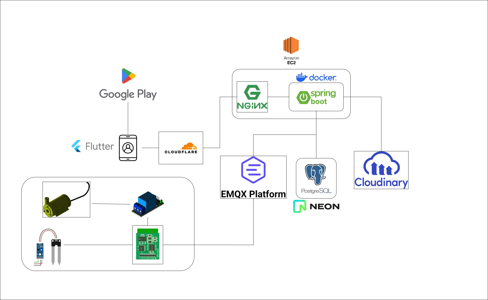

# Project Architecture



# 1. Prerequisite

Cài đặt JDK 17+ nếu chưa thì cài đặt [JDK](https://www.oracle.com/java/technologies/javase/jdk17-archive-downloads.html)

Install Maven 3.5+ nếu chưa thì cài đặt [Maven](https://maven.apache.org/download.cgi)

Install IntelliJ nếu chưa thì cài đặt [IntelliJ](https://www.jetbrains.com/idea/download/?section=windows)

Install Docker nếu chưa thì cài đặt Docker [Docker](https://docs.docker.com/get-docker/)

# 2. Technical Stacks

Java 17

Maven 3.5+

Spring Boot 3.3.4

Spring Data Validation

Spring Data JPA

Postgres/MySQL (optional)

Lombok

DevTools

Docker

Docker compose

Grafana

Prometheus

ELK (Elasticsearch, Logstash, Kibana)

logstash

sonarqube

jenkins

docker-hub

…


# 3. Build & Run Application

– Run application bởi mvnw tại folder backend-service

```bash
  $ ./mvnw spring-boot:run
```

– Run application bởi docker
```bash
  $ mvn clean install -P dev
  $ docker build -t backend-service:latest .
  $ docker run -it -p 8080:8080 --name backend-service backend-service:latest
```


# 4. Test

– Check health với cURL

```bash
  curl --location 'http://localhost:8080/actuator/health'
```

-- Response --

{
    "status": "UP"
}

– Truy cập Backend service để test các API
